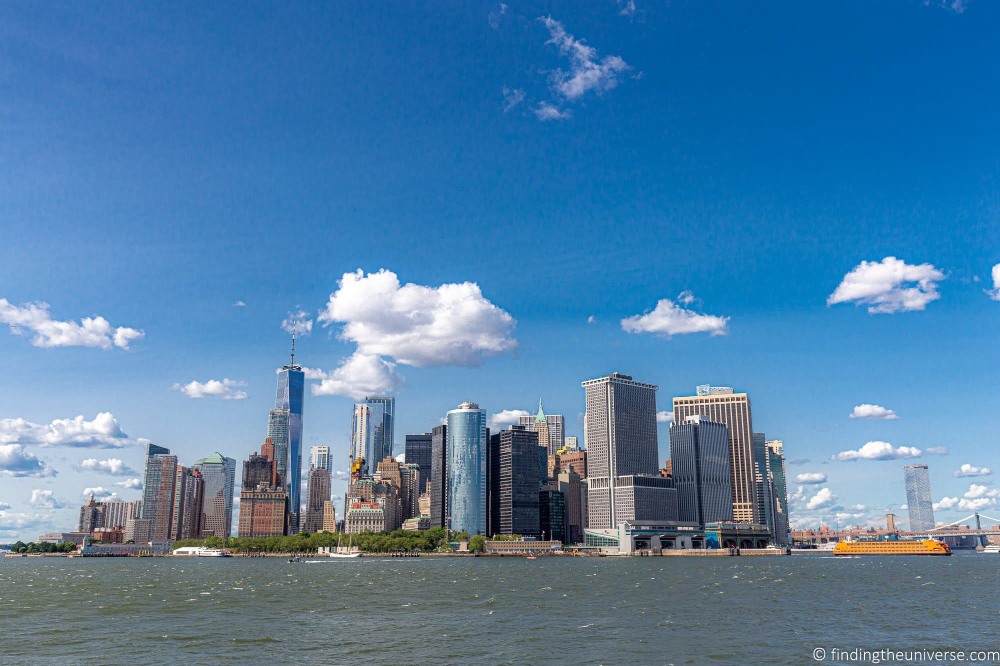
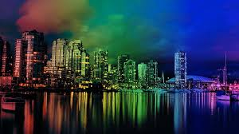
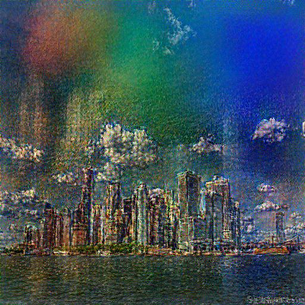
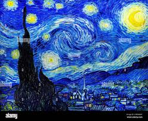
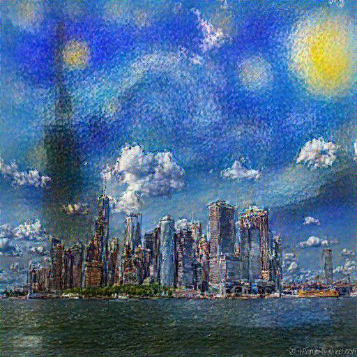
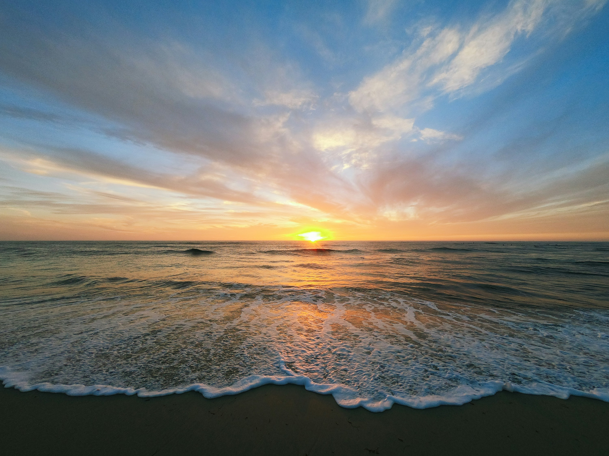
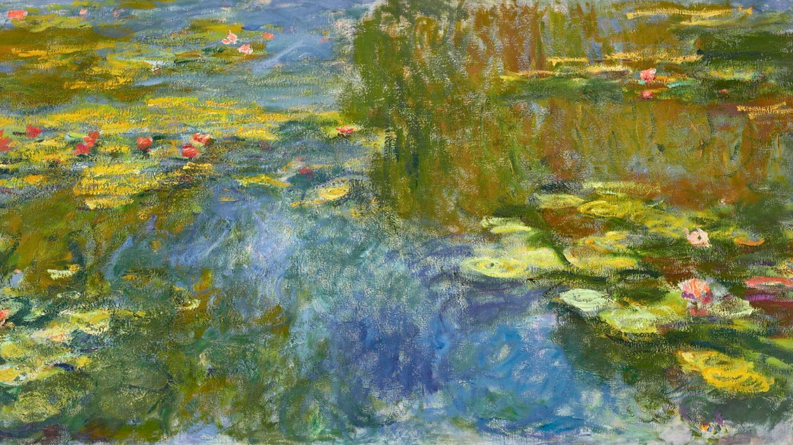
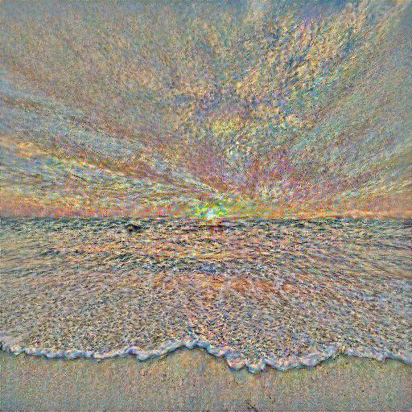

## Image Style Transfer

**Implementation of "Image Style Transfer Using Convolutional Neural Networks" (Gatys et al.)**

---

## Overview

This project implements **Image Style Transfer**, a technique that combines the **content of one image** with the **style of another image** to generate a new artistic output.

* Implemented from **scratch** using PyTorch, without relying on pre-built style transfer libraries.
* Includes key components such as:

  * **Content loss**
  * **Style loss (Gram matrices)**
  * **Total variation loss**
  * Optimization with **L-BFGS**

 For a detailed explanation of the project, concepts, and my learning journey, check out my blog post: **[Here](https://nirdeshdevadiya.me/blog/image-style-transfer.html)**

---

## ✨ Features

* **PyTorch implementation** of Neural Style Transfer.
* Optimized using **L-BFGS optimizer** for faster convergence.
* Adjustable weights (`alpha` for content, `beta` for style).
* Extendable codebase for experiments with new loss functions or architectures.

---

##  Installation

```bash
# Clone repository
git clone https://github.com/nirdesh17/style-transfer.git
cd style-transfer
```

---

##  Usage

Run style transfer with your own content and style images:

```bash
python src/run.py --content path/to/content.jpg --style path/to/style.jpg --output output.jpg
```

Optional changes:

* `iterations` : Number of optimization steps (default: 500)
* `alpha` : Content weight (default: 1)
* `beta` : Style weight (default: 1e6)

---

##  Results

| Content Image | Style Image | Output |
| ------------- | ----------- | ------ |
|  |  |  |
|  |  |  |
|  |  |  |


##  Project Structure

```
style-transfer/
│── src/                
│   ├── run.py          
│── images/            
│   ├── content
│   ├── style
│   ├── outputs
│── README.md           
```

---

##  Future Work

* Multi-style transfer (combine multiple styles).
* Real-time transfer using feed-forward networks.
* Web/GUI demo for interactive use.

---

##  Acknowledgements

* [Image Style Transfer Using CNNs (Gatys et al.)](https://www.cv-foundation.org/openaccess/content_cvpr_2016/papers/Gatys_Image_Style_Transfer_CVPR_2016_paper.pdf)
* [PyTorch Documentation](https://pytorch.org/docs/stable/index.html)
* [NumPy Documentation](https://numpy.org/doc/)

---

##  Connect with Me

* [LinkedIn](https://www.linkedin.com/in/nirdesh-devadiya)

---

